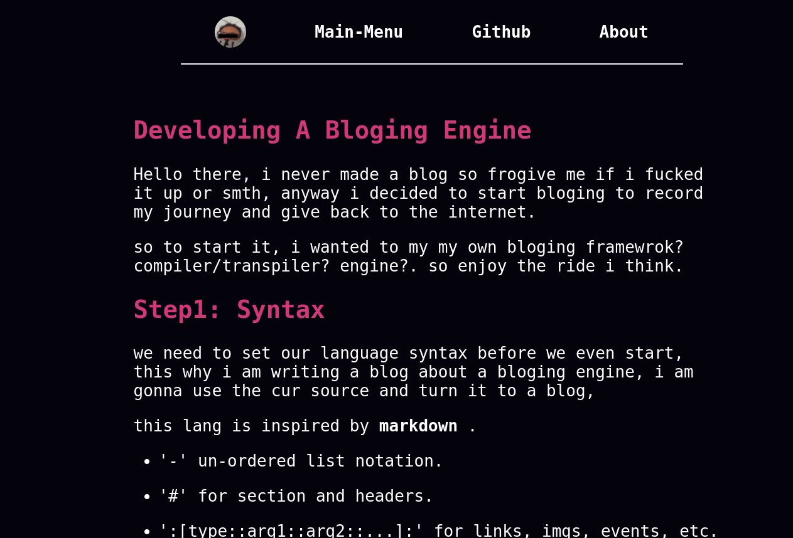

# Keyboger 
i need a place where to put blogs, so i am making a bloging website but i want to write my blog and the website gets created by it self. so i am building a simple bloging engine i think.     

# Run It!
-   Clone the repo using ```git clone --depth=1 git@github.com:t-88/keyboger.git```.
-   Copy the workshop out of the repo, all the work gonna happen there
-   Run ```$ ./keyboger_main.py```
-   To test ur blog do ```$ ./keyboger_main.py test dir-name-for-ur-blog```
-   this is a already build example blog for the use

# Imgs

