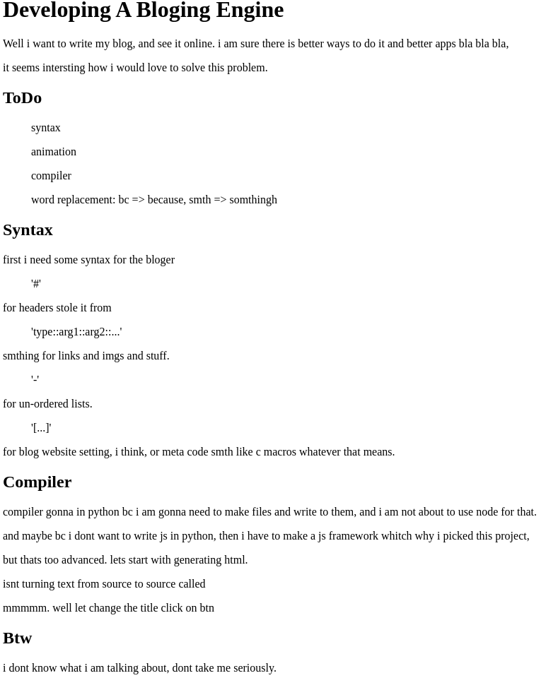

# Keyboger 
i need a place where to put blogs, so i am making a bloging website but i want to write my blog and the website gets created by it self. so i am building a bloging engine?? 

# Run It!
```
    ./keyboger.py > index.html
```
# Imgs


## ToDo
-   syntax
-   transpiler
-   animation
